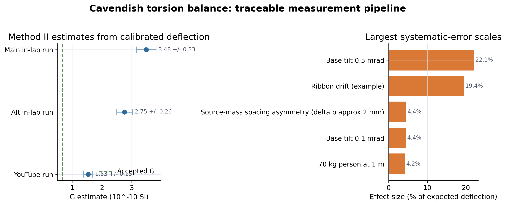

# Cavendish torsion balance: laser tracking and time-series analysis

This repository documents a Cavendish torsion balance experiment using video-based laser-spot tracking, calibrated position reconstruction, and uncertainty-aware analysis of the gravitational constant.

## Project Overview

This project highlights reproducible time-series analysis from imperfect observational
data. The workflow turns raw tracking outputs into calibrated measurements, records
systematic-error assumptions, and regenerates report tables from code.

## At a Glance

- **Data workflow:** video-derived laser-spot tracks are converted into calibrated
  displacement series and report-ready summary tables.
- **Methods signal:** computer-vision preprocessing, time-series reconstruction,
  calibration metadata, and systematic-error accounting.
- **Reproducibility signal:** one script rebuilds processed CSVs, summary tables, and
  the data catalog used by the report.
The main emphasis is traceability: raw tracking files, calibration choices, processed
position series, and report-facing tables remain linked through code.

## What the code does

- Track the reflected laser spot from video with OpenCV
- Convert pixel coordinates to physical displacement
- Reconstruct equilibrium shifts and oscillation behavior across multiple runs
- Recompute Method II results and the systematic-error table used in the report
- Export processed datasets and summary tables from the raw inputs

## Analysis preview

The summary figure below is regenerated from `results/method2_summary.csv` and
`results/systematics_table3.csv` by the reproducibility script.



## Reproduce the analysis artifacts

```bash
pip install -r requirements.txt
python scripts/reproduce_report_artifacts.py
```

Generated outputs include:

- `data/processed/*.csv`
- `results/method2_summary.csv`
- `results/systematics_table3.csv`
- `results/data_catalog.csv`
- `figures/method2_overview.png`

## Repository structure

```text
data/raw/        Raw laser-spot tracking CSVs
data/metadata/   Calibration and fit metadata used by the report
data/processed/  Generated calibrated position tables
figures/         Key plots used in the report
results/         Recomputed summary tables
scripts/         Reproducibility scripts
src/             Core tracking and analysis code
reports/         Final PDF report and LaTeX source
```

## Raw data fields

The tracking CSV files contain:

- `Frame`: video frame index
- `Time_Sec`: time in seconds
- `X`, `Y`: laser-spot centroid in pixels
- `Mode`: `TRACKING` or `RECOVERED`
- `Area`, `Circularity`: blob-shape diagnostics

## Report

- Final report: `reports/report_final.pdf`

## Author

Hongyu Wang  
Lab partner: Cici Zhang
